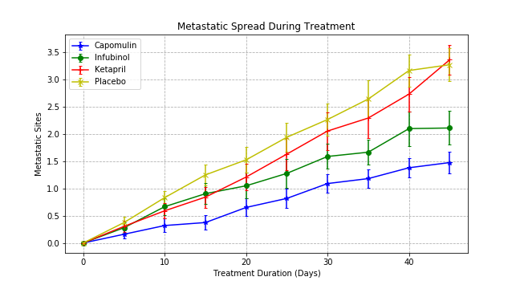
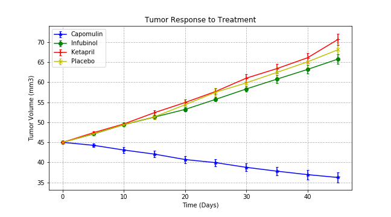
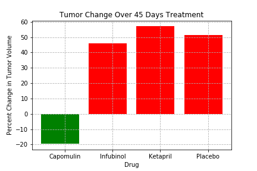
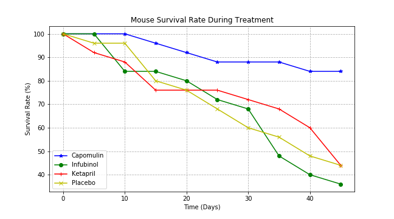

# Matplotlib-Challenge
 
This project uses python, pandas, and matplotlib to analyze the efficacies of cancer-treating drugs on metastatic spread and survival rates.

### Study Findings
This study focused on the treatment drug effects of Capomulin, Infubinol, and Ketapril, as well as a placebo therapy during mice trials. 
The drug Capomulin was the most effective at decreasing tumor size and reducing the rate of metatastic spread compared to placebo and the other two study drugs in the course of the experiment.

Furthermore, Capomulin was the only drug of the four compared variables (Capomulin,Infubinol, Ketapril, and Placebo) that actually decreased tumor size instead of just slowing down the progression of tumor mass increase.

Mouse survival rates were the highest in the group treated with Capomulin (over 80% survived the course of treatment of 45 days), compared to less than 50% mouse survival rate of the Placebo, Infubinol, Ketapril groups.

Contact:

LinkedIn: https://www.linkedin.com/in/marsha-vongjesda/
